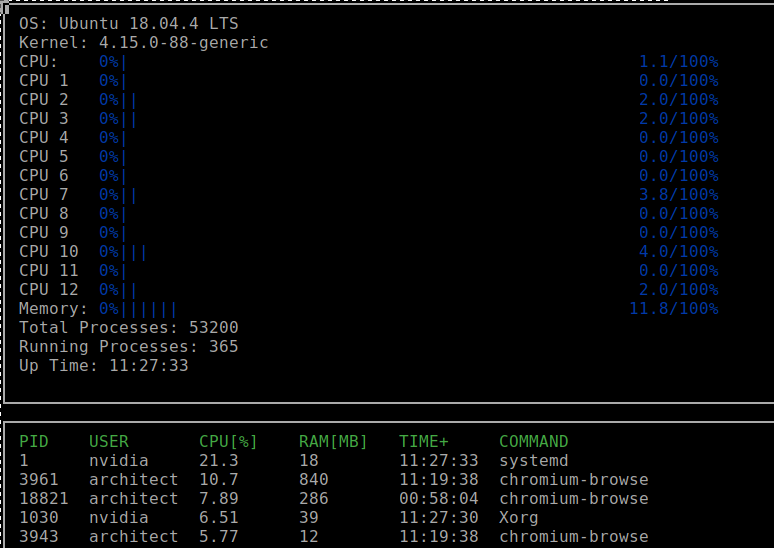

# CppND-System-Monitor
Project of the C++ Nanodegree Program

# Dependencies

 ncurses
[ncurses](https://www.gnu.org/software/ncurses/) is a library that facilitates text-based graphical output in the terminal. This project relies on ncurses for display output.

Install ncurses with terminal command:
`sudo apt install libncurses5-dev libncursesw5-dev`

## Make
This project uses [Make](https://www.gnu.org/software/make/). The Makefile has four targets:
* `build` compiles the source code and generates an executable
* `format` applies [ClangFormat](https://clang.llvm.org/docs/ClangFormat.html) to style the source code
* `debug` compiles the source code and generates an executable, including debugging symbols
* `clean` deletes the `build/` directory, including all of the build artifacts

## Instructions

1. Clone the project repository: `git clone https://github.com/ChrisProgramming2018/C-NanoDegree`
2. Go to the directory:  `cd CppND-System-Monitor/
`
3. Build the project: `make build`

4. Run the resulting executable: `./monitor -h` 
   To see possible command line arguments
