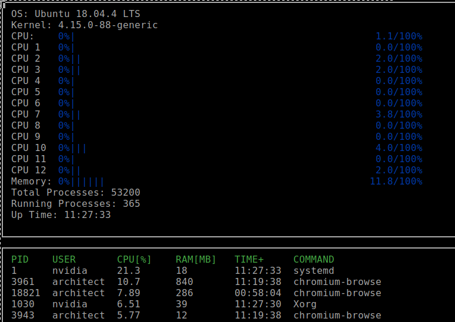

# C++ NanoDegree Projects
Project implementation of Udacity C++ NanoDegree Program

## Route-Planning-Project

Use planning Algorithm A star to find shortest path between start und end point 

## System-Monitor

Use Ncurses to display the Computer resources  on the terminal

